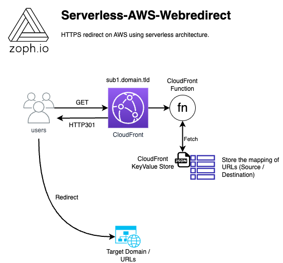
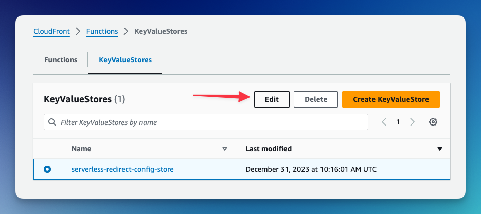

# Serverless AWS WebRedirect

## 📣 Intro

Previously, this blueprint used Route53 record associated with a static web hosting enabled S3 bucket. The trade-off of this pattern was it only supports `HTTP` protocol. Red flag 🚩

Nowadays, there is are much better options using Amazon CloudFront and CloudFront function. It's still serverless and supports `HTTPS` natively. It also enables new capabilities thanks to the newly released [KeyValue Store](https://docs.aws.amazon.com/AmazonCloudFront/latest/DeveloperGuide/kvs-with-functions.html) feature in CloudFront.

This revised version will let you redirect subdomains to any other APEX domain, subdomains or URL.

### Features

- **URL Redirect**: Redirect multiple source subdomains to target URLs
- **Easy URLs Management**: Manage target URLs directly using the CloudFront AWS Console

Examples:

- `blog.zoph.io` -> `https://zoph.me`
- `asd.zoph.io` -> `https://awssecuritydigest.com`
- `book.zoph.io` -> `https://calendly.com/zophio/30min-meeting/`

## 📐 Schema



## 🧱 AWS Building Blocks

> ℹ️ The following assets will be deployed to your AWS account.

1. CloudFront Distribution
2. CloudFront Function
3. CloudFront KeyValueStore
4. S3 Buckets
5. S3 Bucket Policy
6. Route53 Records

### ⌨️ Configuration

> ℹ️ Fill following parameters in the `Makefile` with your own values.

```bash
###################### Parameters ######################
ProjectName := "my-project-name" # Give a name for your project
AWSRegion := eu-west-1 # AWS Region used for deployment
SourceNakedDomain := domain.tld # Source domain
SourceSubDomainList := "sub1,sub2" # Source subdomains
R53HostedZoneId := Z1BPJ52MEEXXXX # Source domain R53 hosted zone id
# Use Wildcard Certificate if multiple subdomains
CertificateArn := "arn:aws:acm:us-east-1:...." # us-east-1 Arn of ACM Public Certificate associated
#######################################################
```

#### Setup Redirection targets

> ℹ️ Update the `config.json` file according to your needs

```json
{
  "data": [
    {
      "key": "sub1.domain.tld",
      "value": "google.com"
    },
    {
      "key": "sub2.domain.tld",
      "value": "aws.amazon.com/cloudfront/"
    }
  ]
}
```

### ⌨️ Deployment

> ℹ️ Run the following command (where your AWS CLI is authencated)

```bash
    $ make requirements
    $ make deploy
```

> Give a try with this command: `$ make test`

### 📝 Update target URLs (Console)

> ℹ️ You will be able to change target url using the CloudFront Console, in the KeyValueStores section



### ❌ Remove

```bash
    $ make tear-down
```

## 🎖️ Credits

- 🏴‍☠️ AWS Security Boutique: [zoph.io](https://zoph.io?utm_source=serverless_redirect)
- 💌 [AWS Security Digest Newsletter](https://awssecuritydigest.com?utm_source=serverless_redirect)
- 🐦 𝕏/Twitter: [zoph](https://x.com/zoph)

## 🤔 Inspiration

- [AWS BlogPost: KeyValue Store](https://aws.amazon.com/blogs/aws/introducing-amazon-cloudfront-keyvaluestore-a-low-latency-datastore-for-cloudfront-functions/)
- [AWS Documentation](https://docs.aws.amazon.com/AmazonCloudFront/latest/DeveloperGuide/example-function-redirect-url.html)
- [CloudFormation Loop](https://aws.amazon.com/blogs/devops/exploring-fnforeach-and-fnfindinmap-enhancements-in-aws-cloudformation/)
- [Multiple CNAME in CloudFront](https://repost.aws/es/questions/QUUq6yPeMNR6OSKrgXeWO8Mw/cloudformation-and-cloudfront-cname)
