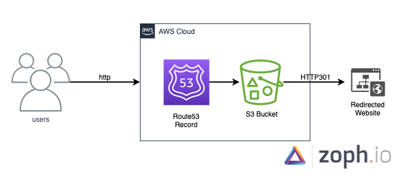

# Serverless AWS HTTP Webredirect

## Rational

Deploy a serverless `http` web redirect using an S3 bucket and a Route53 record.

## Sample

```bash
> http asd.zoph.io
HTTP/1.1 301 Moved Permanently
Content-Length: 0
Date: Tue, 09 Nov 2021 14:00:29 GMT
Location: http://app.mailbrew.com/zoph/aws-security-digest-HrkhwqNrwBBk/
Server: AmazonS3
```

## Schema



## Prerequisite

1. AWS Account
2. Route53 hosted domain name

## Deployment

### Fill following parameters in the `Makefile`

> set your own values

```bash
###################### Parameters ######################
Description ?= serverless-aws-webredirect stack
AWSRegion ?= eu-west-1
SourceDomain ?= asd.zoph.io
R53HostedZoneId ?= Z1BPJ52MEEG8XX
TargetURL ?= zoph.io
#######################################################
```
> run the following command (where your AWS CLI is authencated)

    $ make deploy

> give a try: `curl -I http://<your_source_domain>`

## Credits

- Victor GRENU ([@zoph](https://twitter.com/zoph)) from [zoph.io](https://github.com/zoph-io)
